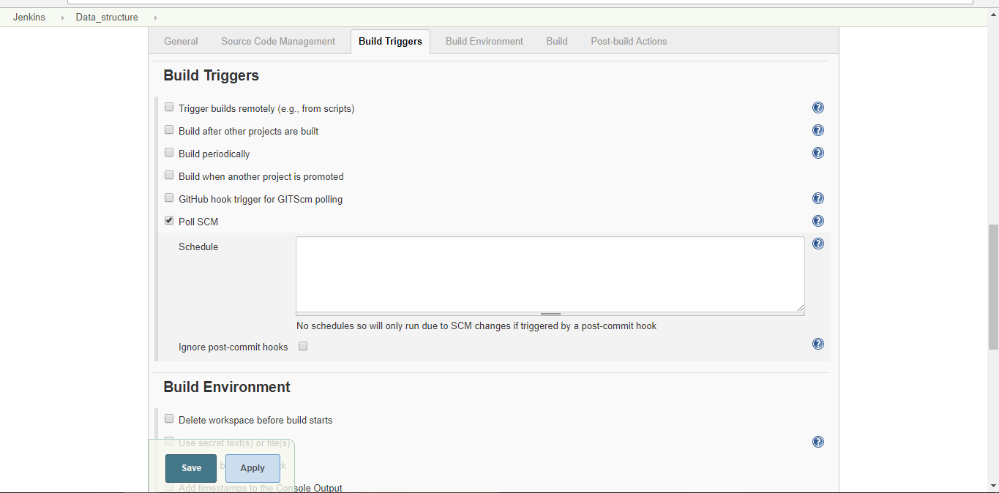
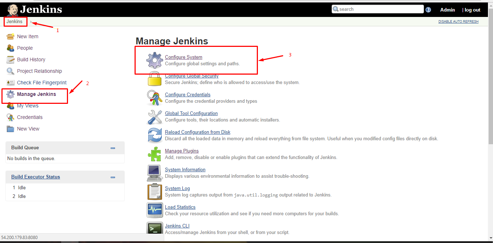
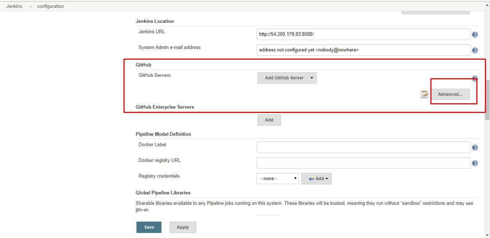
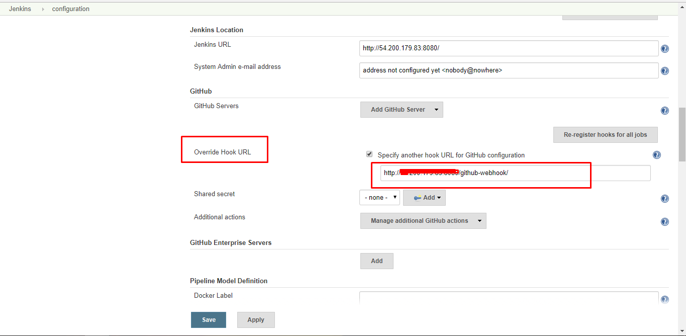
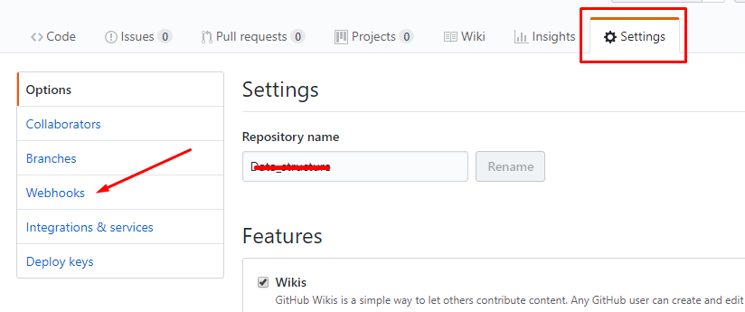
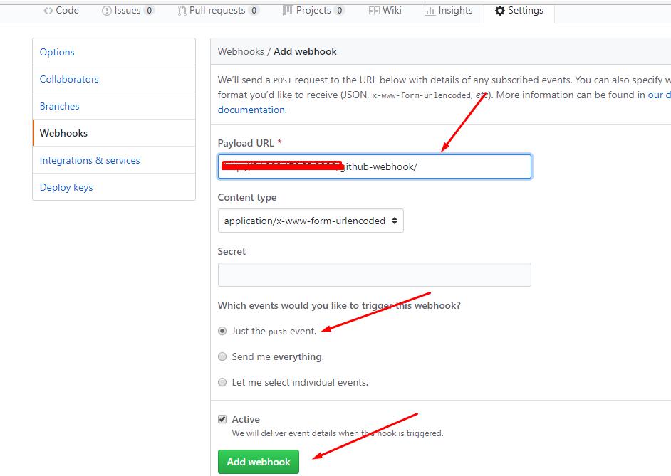
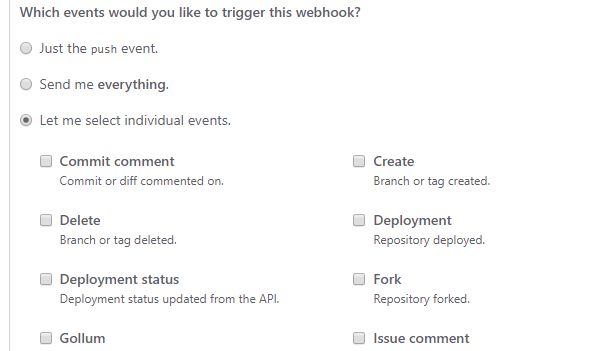
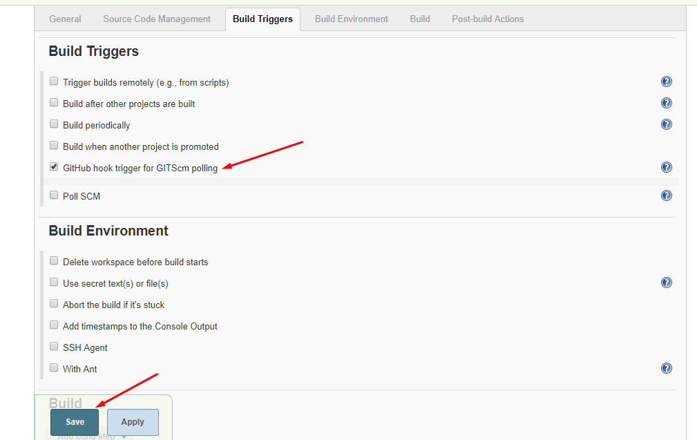

# Cấu hình tự động build và send mail
Jenkins sẽ thực hiện build bất cứ khi nào có commit đến Repo Git vào gửi mail báo cho admin

## Automaticcally run builds
### Polling the repository
*Cấu hình Poll SCM*
Nếu muốn cấu hình đặt lịch cho Jenkins build thì trong phần Configure của Project ở Build Triggers chọn Poll SCm

Tiến hành đặt lịch trong phần Schedule

### Triggering a build using Git hooks
Jenkins sẽ build mỗi khi có commit mới

Ở đây, mỗi khi có code mới pushed tới một repo trên github, git sẽ gửi 1 POST request tới Hook URL, Jenkins sẽ lắng nghe trên Hook URL và thực hiện build khi có POST tới.

Đầu tiên cần lấy Hook URL của Jenkins, Tại Dashboard > Manage Jenkins > Configure System

Tìm tới mục GitHub Plugin, click vào Advanced và copy Hook URL

Tiếp theo, sẽ cần báo cho git biết URL này, mở Repo git của bạn ra, Chọn vào mục Setting và chọn Webhooks 

Chọn Add webhook, paste link vào như bên dưới

Phần `Which events would you like to trigger this webhook?` chọn cái nào có thể đáp ứng được nhu cầu của bạn

Cuối cùng là cấu hình Jenkin Project, trong phần Build Triggers tích chọn `GitHub hook trigger for GITScm polling` rồi Save

## Send mail

# Tham khảo
http://www.andyfrench.info/2015/03/automatically-triggering-jenkins-build.html
https://medium.com/@MaciejNajbar/setup-jenkins-for-private-repository-9060f54eeac9

